<h4 align="center">Welcome! I'm a pentester with a developed hobby for coding. I'm very approachable if you want to speak about anything!</h4>

###

  
  
  
  
  
  
  
  
  
  
  
  
  
  
  

###

  
  
  
  
   
  
  

###

###
